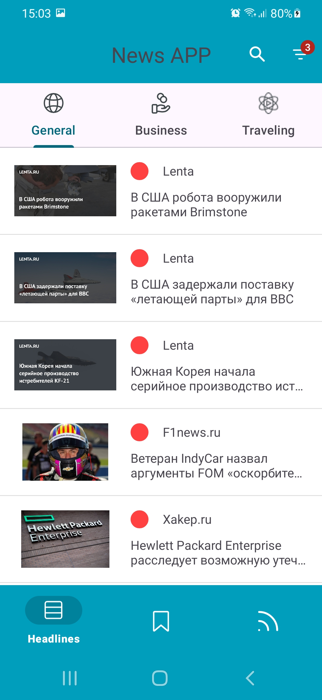

# NewsApplication

Новостной агрегатор, который позволяет просматривать новости по всему миру. Кроме этого позволяет:
- осуществлять поиск новостей по ключевым словам.
- фильтровать новости по языку, дате, источнику.
- сортировать новости по популярности, релевантности, дате.
- сохранять новости.
Реализована работа приложения без сети. В случае отсутствия интернета новости берутся из кэша.
  
Приложение написано на Kotlin, с использованием следующих библиотек: lottie, Moxy (для MVP), Retrofit, RxJava, Picasso, Dagger2, Room, Kotlin Coroutines, swiperefreshlayout. В качестве архитектуры приложения использована Clean Architecture. 
Для отдельных экранов реализованы следующие архитектурные паттерны: MVP, MVVM, MVI.

Установить приложение можно с помощью apk файла, расположенного в папке setup.

  
  
  
  
  
  
  
  

