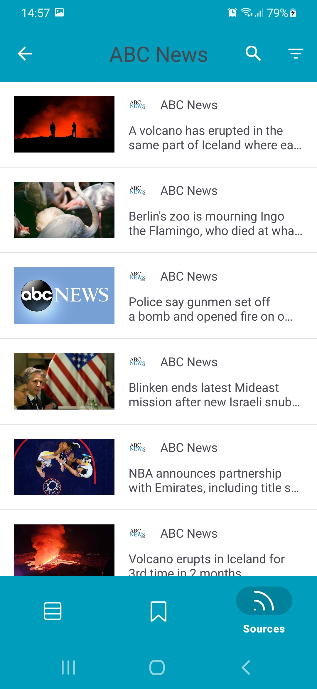

# NewsApplication

News aggregator, which allows watch news by world. Besides allows:
- make news search by keywords.
- filter news by language, date, source.
- sort news by popularity, relevance, date.
- save news.
Realized application work without network. If internet out, news get from cache.
  
Application writed at Kotlin, with usage next libraries: lottie, Moxy (for MVP), Retrofit, RxJava, Picasso, Dagger2, Room, Kotlin Coroutines, swiperefreshlayout. I used Clean Architecture as Application Architecture. For different screens i realized next architecture patterns: MVP, MVVM, MVI.

Install application can with apk file, located in folder setup.

  
  
  
  
  
  
  
  
  

